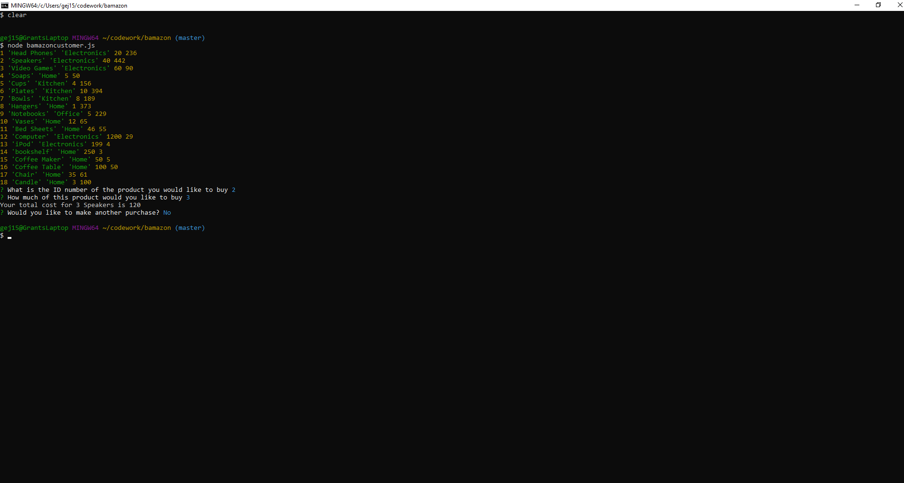
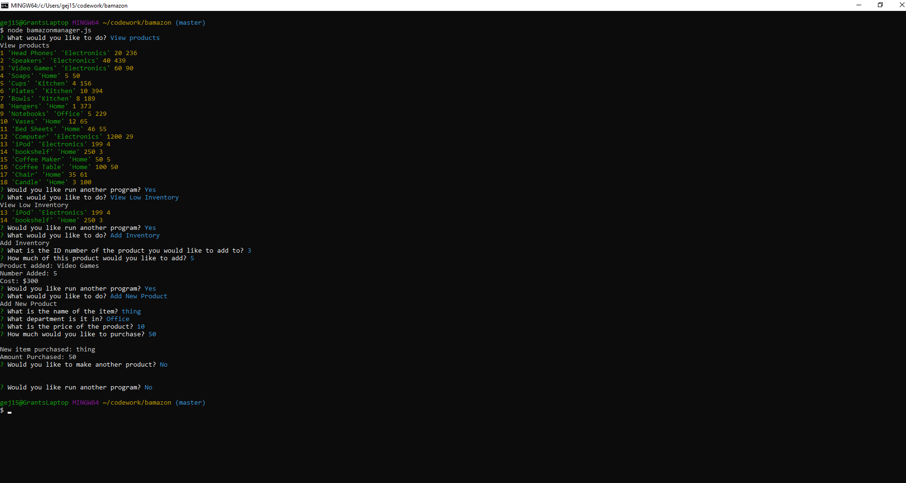
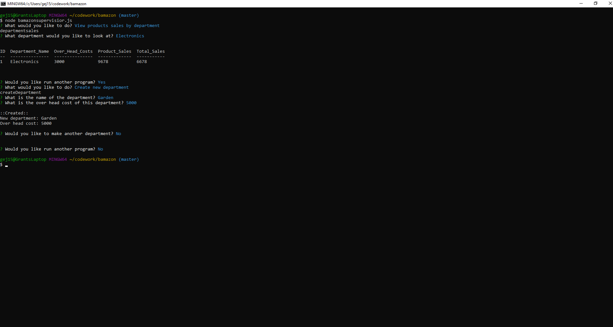

# Banmazon

## What the project does
    This project is a terminal clone that is supposed to act like an online store.

## Why the project is useful
    It is useful to show examples of using node.js and mysql together.

## How users can get started with the project
    To get started with this project a user should use the terminal commands: 
        * node bamazonCustomer.js
        * node bamazonManager.js
        * node bamazonSupervisior.js

    From these commands the app will prompt the rest of the way.
    
## Where users can get help with your project
     
     
    

## Who maintains and contributes to the project
    Grant Jackson will maintain and add updates at a later time